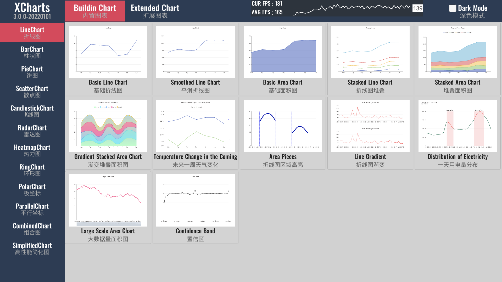
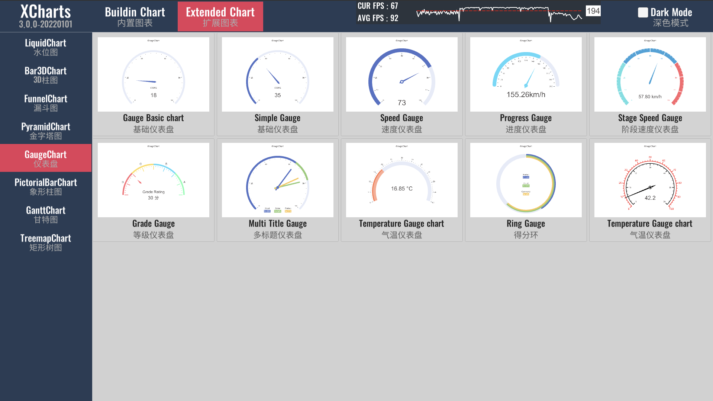

  

<h2 align="center">XCharts</h3>

  A powerful, easy-to-use, configurable charting and data visualization library for Unity.
   
  Unity数据可视化图表插件。
   
  <a href="https://github.com/XCharts-Team/XCharts">中文</a>
  <a href="https://github.com/XCharts-Team/XCharts">中文</a>

  
  
  
  
  
  

  
  
  

A powerful, easy-to-use, configurable charting and data visualization library for Unity.  Supporting line, bar, pie, radar, scatter, heatmap, ring, candlestick, polar, liquid and other common chart. Also support 3d pie, 3d bar, 3d pyramid, funnel, gauge, liquid, pictorialbar, gantt, treemap and ther extended chart.

[XCharts Homepage](https://xcharts-team.github.io)

[XCharts3.0 Tutorial](Documentation~/en/tutorial01.md)  
[XCharts3.0 API](Documentation~/en/api.md)  
[XCharts3.0 FAQ](Documentation~/en/faq.md)  
[XCharts3.0 Configurate](Documentation~/en/configuration.md)  
[XCharts3.0 Changelog](Documentation~/en/changelog.md)  
[XCharts3.0 Support](Documentation~/en/support.md)  

## Features

* Rich built-in examples and templates, parameter visualization configuration, effect real-time preview, pure code drawing.
* Support line, bar, pie, radar, scatter, heatmaps, gauge, ring, polar, liquid and other common chart.
* Support line graph, curve graph, area graph, step graph and other LineChart.
* Support parallel bar, stack bar, stack percentage bar, zebra bar and other BarChart.
* Support ring, rose and other PieChart.
* Support line-bar chart, scatter-line chart and other combination chart.
* Support solid line, curve, ladder line, dotted line, dash line, dot line, double dot line and other lines.
* Support custom theme, built-in theme switching.
* Support custom chart content drawing, drawing points, line, curve, triangle, quadrilateral, circle, ring, sector, border, arrow and other drawing API.
* Support interactive operations such as data filtering, view zooming and detail display on PC and mobile terminals.
* Support 10,000-level big data rendering.
* Support TextMeshPro.

## XCharts3.0 new feature

* Added `Time` axis.
* Added `SingleAxis`.
* Added multiple coordinate systems: `Grid`, `Polar`, `Radar`, `SingleAxis`.
* Added multiple animation methods.
* Added multiple chart interactions.
* Added internationalization support.
* Added `Widgets`.
* Added multiple extension charts.

## XCharts3.0 improvements over XCharts2.0

* More robust underlying framework.
* More powerful performance.
* Smaller serialized files.
* Better interactive experience.
* More component support.
* More powerful ability to self-report text.
* More reasonable component adjustments.
* More flexible component insertion and removal.
* More efficient secondary development.
* Richer Demo examples.

## XCharts3.0 and 2.0 data comparison

| Case | XCharts2.0 | XCharts3.0 | Note |
| -- | -- | -- | -- |
| Fps of 2000 data line chart | ` 20 ` | ` 83 ` |  Performance improvements `3` times |
| Vertices of 2000 data line chart  | ` 36.5 k ` | ` 6.7 k ` | Vertices reduce `4` times |
| Prefab size of 2000 data line chart | ` 11.1 MB ` | ` 802 KB ` | Serialized file size to reduce `10` times |
| Max data of a single line chart | ` 4.1 k ` | ` 19 k ` | Single Serie data capacity improvement `4` times |
| Num of chart support | ` 11 ` | ` 23 ` | More than `1` times as many chart are supported |

## Screenshots

For more examples, see [XCharts-Demo](https://github.com/XCharts-Team/XCharts-Demo), You can also go to [Online Demo](https://xcharts-team.github.io/demo/) to see the running effect of `WebGL`.

## Use

1. Import `XCharts` unitypackage or source code into the project.
2. Right-click `Hierarchy` view and choose `XCharts->LineChart` to create a default LineChart.
3. You can adjust the parameters of each component in `Inspector` and see the real-time effects in `Game` view.

See more tutorial: [XCharts tutorial: 5 minutes overhand tutorial](Documentation~/en/tutorial01.md)  

## FAQ

1. Is `XCharts` free to use?  
A: `XCharts` uses the `MIT` licence and is free to use. You can also subscribe to `VIP` to enjoy more value-added services.

2. Does `XCharts` support code to dynamically add and modify data? Does it support getting data from `Excel` or a database?  
A: Support code to dynamically add and modify data, but data needs to be parsed or retrieved by itself, and then added to `XCharts` by calling the public interface of `XCharts`.

3. Does this plugin work on other platforms (e.g. Winform or WPF) besides Unity?  
A: It is currently only supported on Unity. Theoretically any version of Unity that supports `UGUI` can run `XCharts`.

## Changelog

[Changelog](Documentation~/en/changelog.md)  

## Licenses

[MIT License](https://github.com/XCharts-Team/XCharts/blob/master/LICENSE.md)

## Other

email: `monitor1394@gmail.com`
